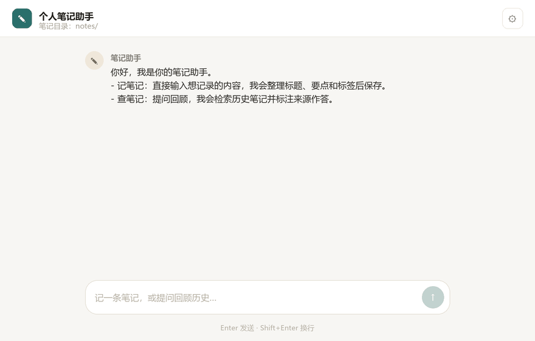
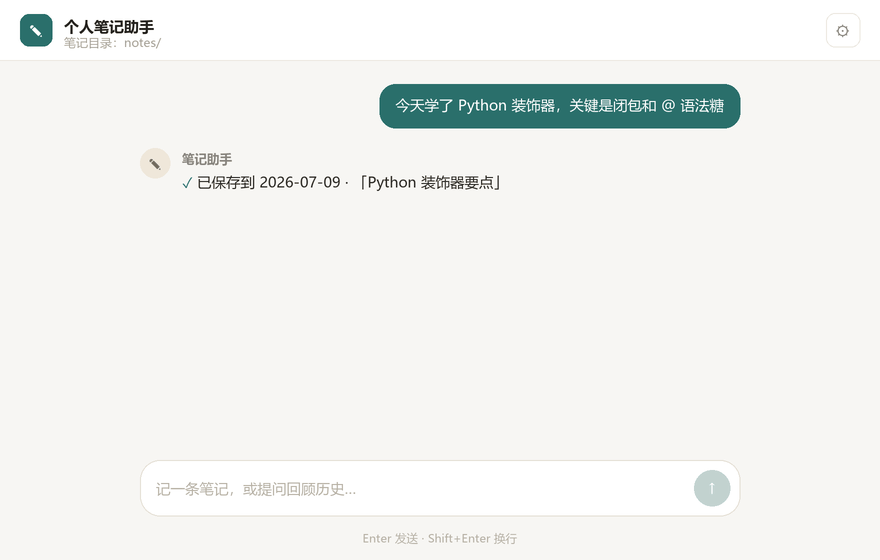

# Easy Note · 会整理的个人笔记助手

> 像聊天一样记笔记。你随口说一句，它替你提炼标题、整理要点、打好标签，按日期归档；想回顾时直接问，它检索你的全部笔记并**标注出处**回答。

不用学命令，不用想分类，**说人话就行**。


```
你：今天学了 Python 装饰器，关键是闭包和 @ 语法糖
Easy Note：✅ 已保存到 2026-07-09 · 「Python 装饰器要点」 #Python #语言特性

你：我之前关于装饰器记了什么？
Easy Note：你在 7-09 记过装饰器的核心是闭包与 @ 语法糖……（来源：notes/2026-07-09.md）
```


---

## 🎬 看它怎么用

**① 记笔记 —— 说人话，它替你提炼标题、打标签、按日期归档**

<p align="center"></p>

**② 查笔记 —— 自然语言提问，检索你的全部笔记并标注出处作答**

<p align="center"></p>

> 上图为界面演示。真实效果取决于你接入的模型；配置好 API 后即为你在窗口里看到的样子。

---

## 💾 下载即用（免装 Python）

不想折腾环境？直接下载打包好的桌面应用，解压双击即可运行。

| 平台 | 下载 | 使用方式 |
|---|---|---|
| **Windows** | [EasyNote.exe](https://github.com/lvmaizi/easy-note/releases/) | 双击 `EasyNote.exe` |
| macOS | [EasyNote.dmg](https://github.com/lvmaizi/easy-note/releases/) | 打开 dmg，把 `EasyNote.app` 拖到「应用程序」；首次打开需执行下方命令 |

> **macOS 首次打开提示**：app 未签名，双击会被 Gatekeeper 拦截（提示「已损坏」或「无法验证开发者」）。打开「终端」执行：
>
> ```bash
> xattr -cr /Applications/EasyNote.app
> ```
>
> 然后双击即可运行。这是开源应用未签名的常见限制，后续版本会考虑加入 Apple 公证。

**首次启动后**：点窗口右上角 **⚙ 设置**，填入你自己的 OpenAI 兼容 API 地址与密钥，即可开始记笔记。配置保存在用户数据目录（Windows `%APPDATA%\EasyNote`、macOS `~/Library/Application Support/EasyNote`），不会随程序卸载丢失。

---

## 为什么用它

- 📝 **记得随意，存得整齐** —— 你只管把想法丢进来，标题、要点、标签由它自动整理，每天一个 Markdown 文件，永远不乱。
- 🔍 **问得自然，答得有据** —— 用大白话提问，它检索你的笔记并标注来源，不编造、可溯源。
- 🗂️ **你的笔记，你的文件** —— 全部以纯 Markdown 落盘在本地目录，可用任意编辑器打开、可同步、可备份，**不锁定、不上云**。
- 💬 **桌面聊天界面** —— 实时显示「思考中…」与检索 / 读取 / 保存的活动轨迹，回答以 Markdown 渲染。
- ⚙️ **开箱即配** —— 窗口内图形化修改笔记目录、模型与密钥，保存即生效并持久化。
- 🔌 **兼容任意 OpenAI 接口** —— 官方、第三方、本地自部署模型都能接。
- 🧠 **Agent 架构 + 三档上下文压缩** —— 思考→调用工具→观察→再思考的完整循环；长对话自动压缩（snip / micro / auto），不超 token 预算。

---

## 快速开始

### 方式一：下载打包应用（推荐，零环境配置）

1. 下载上方 [EasyNote](https://github.com/lvmaizi/easy-note/releases/) 
2. 双击 `EasyNote` 启动；
3. 在 **⚙ 设置** 中填入 OpenAI 兼容 API 地址与密钥；
4. 直接在输入框记笔记即可。

### 方式二：从源码运行

```bash
git clone https://github.com/your-name/easy-note.git
cd easy-note
pip install -r requirements.txt
python -m src.ui.app                # 或 python run_gui.py
```

环境要求：**Python 3.10+**，以及一个 OpenAI 兼容的 LLM API。


## 交互

- **记笔记**：直接输入想记的内容（如「今天学了 Python 装饰器，关键是闭包和 @ 语法糖」），AI 整理后落盘。
- **查笔记**：用自然语言提问回顾（如「我关于装饰器记了什么？」），AI 检索笔记目录并标注来源作答。
- 输入框：`Enter` 发送，`Shift+Enter` 换行。
- 处理中禁用输入，串行执行以保护单一会话上下文。

---

## 笔记长什么样

每天一个 `notes/YYYY-MM-DD.md`，纯 Markdown，可被任何编辑器或笔记软件打开：

```markdown
# 2026-07-09

## 15:45 Python 装饰器要点
- 本质是返回函数的高阶函数，依赖闭包捕获外层变量
- `@` 只是 `f = deco(f)` 的语法糖

Tags: #Python #语言特性
---
```

---

欢迎在 Issue 区提需求与反馈。

---

## 贡献

欢迎提交 Issue 与 Pull Request。提交前请确保**不包含任何私密配置或密钥**（`config.yaml` 已在 `.gitignore` 中）。

## 许可证

[MIT](LICENSE)
